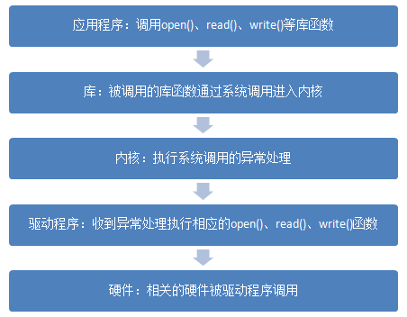

# 1 字符设备

## 1.1 Linux驱动程序概述
		在动手写程序之前，先了解一下基本的Linux设备及驱动程序相关的知识。
### 1.1.1 Linux应用程序与驱动程序的关系
	    Linux应用程序调用驱动程序的步骤大致如下：

	    ①应用程序调用库函数提供的open()函数打开某个设备文件；  
	    ②库根据open()函数的输入参数引起CPU异常，进入内核；  
	    ③内核的异常处理函数根据输入参数找到相应的驱动程序，返回文件句柄给库，库函数再返回给应用程序；  
	    ④应用程序再使用得到的文件句柄调用write()、read()等函数发出控制指令；  
	    ⑤库根据write()、read()等函数的输入参数引起CPU异常，进入内核；  
	    ⑥内核的异常处理函数根据输入参数调用相应的驱动程序执行相应的操作。  

	    步骤①中open()函数打开的设备文件，是在驱动加载成功后再目录”/dev”中生成的相关文件，是应用程序调用对应硬件的入口。  
        在这个过程中应用程序涉及到的open()、read()、write()等由库提供的接口函数成为系统调用，他们通过执行某条指令引发异常进入内核，是应用程序操作硬件沟通的途径。应用程序执行系统调用后，最终会使用驱动函数中对应的函数，而驱动函数中的open()、read()、write()等函数则需要驱动开发人员去实现。

        应用程序运行于用户空间，驱动程序运行于内核空间。Linux系统可以通过MMU限制应用程序运行在某个内存块中，以避免这个应用程序出错导致整个系统崩溃。而运行于内核空间的驱动程序是系统的一部分，驱动程序出错有可能牵连整个系统，因此在实现驱动时要格外小心。
### 1.1.2 Linux驱动程序的分类
		驱动可分为三类：字符设备驱动、块设备驱动、网络设备驱动。
		字符设备即是按字节访问的设备。比如以一个字节的收发数据的串口，就是典型的字符设备。还有较为简单简单的我们接下来会讲的LED灯驱动，相对复杂的如音频都属于字符设备，字符设备在Linux外设中占比最大。
		块设备的特点是他们是按一定格式存取数据，具体的格式有文件系统决定。他们通常以存储设备为主如EMMC、FLASH、SD卡、EEPROM等。存储设备的特点是以存储块为基础，因此得名为块设备。
		对于应用程序来说，块设备和字符设备访问方式基本无差，即驱动程序实现系统调用，应用程序通过设备文件（比如/dev/mtd0、/dev/i2c-0等）来调用对应的库函数。当然这需要驱动程序开发者来保证，即再实现块设备驱动时将数据按一定格式组织成块后再进行读写。另外，块设备还需要向内核其他部件提供一些接口，使得块设备上可以存放文件系统挂接块设备。因此块设备驱动的实现相比字符设备驱动要复杂得多。
		网络设备比较特殊，应用程序和网络设备驱动间的通信与上面两种设备完全不同，由库和内核提供的一套数据包传输函数替代了open()、read()、write()等函数。但是网络设备也很好理解和辨认，WIFI或者有线接口都属于网络设备。
		设备驱动中还会出现一个驱动包含多种设备驱动的情况，如SPI（字符设备）连接的FLASH（块设备）、USB接口（字符设备）的WIFI（网络设备）。接下来我们会循序渐进的学习各种设备的驱动，由浅入深，先从最简单的字符设备开始。
## 1.2 字符设备的开发步骤
		Linux驱动程序是有框架的，现有框架方便的我们增加新的驱动程序，熟悉现有框架之后，在现有驱动程序上稍微修改就能得到新设备的驱动，而学习现有框架就是我们的目标之一。
		熟悉框架之后，实现设备驱动的步骤大致如下：
		①查看原理图以及数据手册了解设备操作方法；
		②修改设备树文件；
		③套用与设备相近的框架，或找到内核中相似设备的驱动代码直接修改，实现驱动程序的初始化以及操作函数；
		④将驱动编译进内核或单独编译加载驱动；
		⑤编写应用程序测试驱动程序。
		不难看出上述步骤中重点以及难点是步骤③，下面我们细说字符设备驱动中步骤③中需要实现的内容。
### 1.2.1 实现系统调用
		系统调用即设备操作函数，是字符设备驱动的核心。在内核文件include/linux/fs.h中定义了数据结构file_operations，涵括了所有内核驱动操作函数，内容如下：
		1.	truct file_operations {  
		2.			struct module *owner;  
		3.			loff_t (*llseek) (struct file *, loff_t, int);  
		4.			ssize_t (*read) (struct file *, char __user *, size_t, loff_t *);  
		5.	    	ssize_t (*write) (struct file *, const char __user *, size_t, loff_t *);  
		6.	    	ssize_t (*read_iter) (struct kiocb *, struct iov_iter *);  
		7.	    	ssize_t (*write_iter) (struct kiocb *, struct iov_iter *);  
		8.	    	int (*iterate) (struct file *, struct dir_context *);  
		9.	        int (*iterate_shared) (struct file *, struct dir_context *);  
		10.	        unsigned int (*poll) (struct file *, struct poll_table_struct *);  
		11.	        long (*unlocked_ioctl) (struct file *, unsigned int, unsigned long);  
		12.	        long (*compat_ioctl) (struct file *, unsigned int, unsigned long);  
		13.	        int (*mmap) (struct file *, struct vm_area_struct *);  
		14.	        int (*open) (struct inode *, struct file *);  
		15.	        int (*flush) (struct file *, fl_owner_t id);  
		16.	        int (*release) (struct inode *, struct file *);  
		17.	        int (*fsync) (struct file *, loff_t, loff_t, int datasync);  
		18.	        int (*fasync) (int, struct file *, int);  
		19.	        int (*lock) (struct file *, int, struct file_lock *);  
		20.	        ssize_t (*sendpage) (struct file *, struct page *, int, size_t, loff_t *, int);  
		21.	        unsigned long (*get_unmapped_area)(struct file *, unsigned long, unsigned long, unsigned long, unsigned long);  
		22.	        int (*check_flags)(int);  
		23.	        int (*flock) (struct file *, int, struct file_lock *);  
		24.	        ssize_t (*splice_write)(struct pipe_inode_info *, struct file *, loff_t *, size_t, unsigned int);  
		25.	        ssize_t (*splice_read)(struct file *, loff_t *, struct pipe_inode_info *, size_t, unsigned int);  
		26.	        int (*setlease)(struct file *, long, struct file_lock **, void **);  
		27.	        long (*fallocate)(struct file *file, int mode, loff_t offset, loff_t len);  
		28.	        void (*show_fdinfo)(struct seq_file *m, struct file *f);  
		29.	    #ifndef CONFIG_MMU  
		30.	        unsigned (*mmap_capabilities)(struct file *);  
		31.	    #endif  
		32.	        ssize_t (*copy_file_range)(struct file *, loff_t, struct file *, loff_t, size_t, unsigned int);  
		33.	        int (*clone_file_range)(struct file *, loff_t, struct file *, loff_t, u64);  
		34.	        ssize_t (*dedupe_file_range)(struct file *, u64, u64, struct file *, u64);  
		35.	}

		简单介绍一下接下来的实验中会用到的成员和函数。
		
		成员变量：
			owner   ： 一般设置为THIS_MODULE。
			open    ： 函数指针，已经提到多次，用于打开设备文件。
			write   ： 函数指针，用于向设备写入或发送数据。
			read    ： 函数指针，用于从设备读取数据。
			release ： 函数指针，用于关闭设备文件，与应用程序中的close()函数相对应。
### 1.2.2 驱动模块的加载与卸载
		驱动程序完成后，可以选择编译进内核，或单独编译后使用命令insmod加载到系统中。后者对于驱动开发而言方便很多。驱动程序单独编译后，会得到后缀为.ko的驱动模块文件，比如加载名为led.ko的驱动模块，就使用命令insmod led.ko即可。当然有加载就有卸载，卸载命令为rmmod，卸载驱动预加载驱动稍有区别，不是rmmod led.ko了。可以先使用lsmod命令来查看现已加载的驱动，再使用rmmod命令加空格再加上lsmod命令罗列出的你想卸载的驱动名称即可。
		在实现驱动时，需要注册这两个操作函数，注册函数为：
		module_init(xxx_init);    //注册模块加载函数
		module_exit(xxx_exit);    //注册模块卸载函数
		xxx_init是驱动入口函数，xxx_exit是驱动出口函数。当执行insmod命令时，xxx_init函数就会被调用。xxx_exit函数同理。这两个函数原型也很简单，到下面编码时再说。
### 1.2.3 字符设备的注册与注销
		驱动入口函数是驱动加载时执行的第一个函数，我们需要抓住这个机会在入口函数中实现驱动的初始化即注册字符设备。注册和注销字符设备的函数分别为：
		int register_chrdev(unsigned int major, const char *name, const struct file_operations *fops);
		void unregister_chrdev(unsigned int major, const char *name);
两个函数总共涉及到三个输入参数：
major：主设备号，linux系统下每个设备都有一个设备号，主设备下还有子设备号minor；
name：设备名；
fops：file_operations型指针，设备操作函数合集变量。
1.2.4 Linux设备号
每个设备文件都有主次设备号major，主设备号是唯一的，每个主设备下有次设备号minor，次设备号在这个主设备下也是唯一的。在Linux系统下输入cat /proc/devices命令可以查看已被注册的主设备号。
1.2.5 实现设备操作函数
在接下来的点亮led实验中，会用到那些设备操作函数呢，先看一下点亮led 的步骤。
首先我们要初始化led所连接的IO，使能时钟、设置IO为输出等，open()函数是应用程序关联设备文件的开始，设备的初始化可以放在open()函数中。实现了open()函数必然就要实现对应的release()函数。IO初始化完成后，我们需要点亮led，实际上就是往IO对应的寄存器内写入对应的值，写入自然就是实现write()函数了。相应的，也可以实现read()函数来读取IO当前的状态。
1.2.6 添加驱动描述信息
在驱动代码中我们需要添加LICENSE信息和作者信息等驱动描述信息，其中LICENSE是必须添加的，方法如下：
MODULE_LICENSE("GPL");
现在我们已经知道了注册驱动入口和出口函数、注册和注销字符设备、需要实现的设备操作函数，大致可以写出如下的框架：
1.	/* 驱动名称 */  
2.	#define DEVICE_NAME       "gpio_leds"  
3.	/* 驱动主设备号 */  
4.	#define GPIO_LED_MAJOR    200
5.	  
6.	/* open函数实现, 对应到Linux系统调用函数的open函数 */  
7.	static int gpio_leds_open(struct inode *inode_p, struct file *file_p)  
8.	{     
9.	    return 0;  
10.	}  
11.	  
12.	/* write函数实现, 对应到Linux系统调用函数的write函数 */  
13.	static ssize_t gpio_leds_write(struct file *file_p, const char __user *buf, size_t len, loff_t *loff_t_p)  
14.	{  
15.	    return 0;  
16.	}  
17.	  
18.	/* release函数实现, 对应到Linux系统调用函数的close函数 */  
19.	static int gpio_leds_release(struct inode *inode_p, struct file *file_p)  
20.	{  
21.	    return 0;  
22.	}  
23.	  
24.	/* file_operations结构体声明, 是上面open、write实现函数与系统调用函数对应的关键 */  
25.	static struct file_operations gpio_leds_fops = {  
26.	    .owner   =   THIS_MODULE,  
27.	    .open    =   gpio_leds_open,  
28.	    .write   =   gpio_leds_write,  
29.	    .release =   gpio_leds_release,     
30.	};  
31.	  
32.	/* 模块加载时会调用的函数 */  
33.	static int __init gpio_led_init(void)  
34.	{  
35.	    int ret;  
36.	      
37.	    /* 通过模块主设备号、名称、模块带有的功能函数(及file_operations结构体)来注册模块 */  
38.	    ret = register_chrdev(GPIO_LED_MAJOR, DEVICE_NAME, &gpio_leds_fops);  
39.	    if (ret < 0)   
40.	    {  
41.	        return ret;  
42.	    }  
43.	    else  
44.	    {  
45.	  
46.	    }  
47.	    return 0;  
48.	}  
49.	  
50.	/* 卸载模块 */  
51.	static void __exit gpio_led_exit(void)  
52.	{  
53.	    /* 注销模块, 释放模块对这个设备号和名称的占用 */  
54.	    unregister_chrdev(GPIO_LED_MAJOR, DEVICE_NAME);  
55.	}  
56.	  
57.	/* 注册模块入口和出口函数 */  
58.	module_init(gpio_led_init);  
59.	module_exit(gpio_led_exit);  
60.	  
61.	/* 添加LICENSE信息 */  
62.	MODULE_LICENSE("GPL"); 
这里我把驱动命名为"gpio_leds"。设备号设置为200，我这里200号设备号没有被占用，实际实验要根据自身实际情况更改。
1.3 字符设备驱动开发实验
现在我们已经大致了解了字符设备的实现方法，接下来就一步一步的去实现。我们的目标是编写开发板上”PS LED1”这个led的设备驱动，通过驱动程序能点亮、熄灭这个led。
1.3.1 查看硬件原理图以及数据手册
打开AX7020开发板原理图，查看PS LED1的连接方式。
 
 
可知目标led连接在开发板PS端的MIO0引脚上。
再打开数据手册《ug585-Zynq-7000-TRM.pdf》。根据关键词MIO我们能找到一张MIO对应表再2.4.4节，led的操作对应的引脚功能为GPIO，MIO0对应GIPO0。我们再到寄存器设置” Appendix B: Register Details”章节中找到GPIO的寄存器设置。
 
GPIO寄存器的基地址为0xE000A000，对于GPIO的设置，需要使能、设置方向以及控制，对应找到使能寄存器0xE000A208、方向寄存器0xE000A204、控制（数据）寄存器0xE000A040。另外还需要使能GPIO时钟，找到AMBA外设时钟使能寄存器0xF800012C。
1.3.2 编写字符设备驱动程序
上面我们已经得到了led驱动的大体框架，接下来要做的实际就是晚上设备操作函数中的内容，也是再对应的函数中设置相关的寄存器。在open()函数中实现led初始化，在write()函数中实现led的控制，在release()函数中完成led的使能。最终的带代码如下：
1.	#include <linux/module.h>    
2.	#include <linux/kernel.h>    
3.	#include <linux/fs.h>    
4.	#include <linux/init.h>    
5.	#include <linux/ide.h>    
6.	#include <linux/types.h>    
7.	    
8.	/* 驱动名称 */    
9.	#define DEVICE_NAME       "gpio_leds"    
10.	/* 驱动主设备号 */    
11.	#define GPIO_LED_MAJOR    200    
12.	    
13.	/* gpio寄存器虚拟地址 */    
14.	static unsigned int gpio_add_minor;    
15.	/* gpio寄存器物理基地址 */    
16.	#define GPIO_BASE         0xE000A000    
17.	/* gpio寄存器所占空间大小 */    
18.	#define GPIO_SIZE         0x1000    
19.	/* gpio方向寄存器 */    
20.	#define GPIO_DIRM_0       (unsigned int *)(0xE000A204 - GPIO_BASE + gpio_add_minor)    
21.	/* gpio使能寄存器 */     
22.	#define GPIO_OEN_0        (unsigned int *)(0xE000A208 - GPIO_BASE + gpio_add_minor)    
23.	/* gpio控制寄存器 */    
24.	#define GPIO_DATA_0       (unsigned int *)(0xE000A040 - GPIO_BASE + gpio_add_minor)    
25.	    
26.	/* 时钟使能寄存器虚拟地址 */    
27.	static unsigned int clk_add_minor;    
28.	/* 时钟使能寄存器物理基地址 */    
29.	#define CLK_BASE          0xF8000000    
30.	/* 时钟使能寄存器所占空间大小 */    
31.	#define CLK_SIZE          0x1000    
32.	/* AMBA外设时钟使能寄存器 */    
33.	#define APER_CLK_CTRL     (unsigned int *)(0xF800012C - CLK_BASE + clk_add_minor)          
34.	    
35.	/* open函数实现, 对应到Linux系统调用函数的open函数 */    
36.	static int gpio_leds_open(struct inode *inode_p, struct file *file_p)    
37.	{    
38.	    /* 把需要修改的物理地址映射到虚拟地址 */  
39.	    gpio_add_minor = (unsigned int)ioremap(GPIO_BASE, GPIO_SIZE);    
40.	    clk_add_minor = (unsigned int)ioremap(CLK_BASE, CLK_SIZE);   
41.	  
42.	    /* MIO_0时钟使能 */    
43.	    *APER_CLK_CTRL |= 0x00400000;    
44.	    /* MIO_0设置成输出 */    
45.	    *GPIO_DIRM_0 |= 0x00000001;    
46.	    /* MIO_0使能 */    
47.	    *GPIO_OEN_0 |= 0x00000001;    
48.	        
49.	    printk("gpio_test module open\n");    
50.	        
51.	    return 0;    
52.	}    
53.	    
54.	    
55.	/* write函数实现, 对应到Linux系统调用函数的write函数 */    
56.	static ssize_t gpio_leds_write(struct file *file_p, const char __user *buf, size_t len, loff_t *loff_t_p)    
57.	{    
58.	    int rst;    
59.	    char writeBuf[5] = {0};    
60.	        
61.	    printk("gpio_test module write\n");    
62.	    
63.	    rst = copy_from_user(writeBuf, buf, len);    
64.	    if(0 != rst)    
65.	    {    
66.	        return -1;      
67.	    }    
68.	        
69.	    if(1 != len)    
70.	    {    
71.	        printk("gpio_test len err\n");    
72.	        return -2;    
73.	    }    
74.	    if(1 == writeBuf[0])    
75.	    {    
76.	        *GPIO_DATA_0 &= 0xFFFFFFFE;    
77.	        printk("gpio_test ON\n");    
78.	    }    
79.	    else if(0 == writeBuf[0])    
80.	    {    
81.	        *GPIO_DATA_0 |= 0x00000001;    
82.	        printk("gpio_test OFF\n");    
83.	    }    
84.	    else    
85.	    {    
86.	        printk("gpio_test para err\n");    
87.	        return -3;    
88.	    }    
89.	        
90.	    return 0;    
91.	}    
92.	    
93.	/* release函数实现, 对应到Linux系统调用函数的close函数 */    
94.	static int gpio_leds_release(struct inode *inode_p, struct file *file_p)    
95.	{    
96.	    /* 释放对虚拟地址的占用 */    
97.	    iounmap((unsigned int *)gpio_add_minor);    
98.	    iounmap((unsigned int *)clk_add_minor);    
99.	      
100.	    printk("gpio_test module release\n");    
101.	    return 0;    
102.	}    
103.	        
104.	/* file_operations结构体声明, 是上面open、write实现函数与系统调用函数对应的关键 */    
105.	static struct file_operations gpio_leds_fops = {    
106.	    .owner   = THIS_MODULE,    
107.	    .open    = gpio_leds_open,    
108.	    .write   = gpio_leds_write,       
109.	    .release = gpio_leds_release,     
110.	};    
111.	    
112.	/* 模块加载时会调用的函数 */    
113.	static int __init gpio_led_init(void)    
114.	{    
115.	    int ret;    
116.	        
117.	    /* 通过模块主设备号、名称、模块带有的功能函数(及file_operations结构体)来注册模块 */    
118.	    ret = register_chrdev(GPIO_LED_MAJOR, DEVICE_NAME, &gpio_leds_fops);    
119.	    if (ret < 0)     
120.	    {    
121.	        printk("gpio_led_dev_init_ng\n");    
122.	        return ret;    
123.	    }    
124.	    else    
125.	    {    
126.	        /* 注册成功 */   
127.	        printk("gpio_led_dev_init_ok\n");    
128.	    }    
129.	    return 0;    
130.	}    
131.	    
132.	/* 卸载模块 */    
133.	static void __exit gpio_led_exit(void)    
134.	{    
135.	    /* 注销模块, 释放模块对这个设备号和名称的占用 */    
136.	    unregister_chrdev(GPIO_LED_MAJOR, DEVICE_NAME);  
137.	   
138.	    printk("gpio_led_dev_exit_ok\n");    
139.	}    
140.	    
141.	/* 标记加载、卸载函数 */    
142.	module_init(gpio_led_init);    
143.	module_exit(gpio_led_exit);    
144.	    
145.	/* 驱动描述信息 */    
146.	MODULE_AUTHOR("Alinx");    
147.	MODULE_ALIAS("gpio_led");    
148.	MODULE_DESCRIPTION("GPIO LED driver");    
149.	MODULE_VERSION("v1.0");    
150.	MODULE_LICENSE("GPL");    
	49行出现的printk()函数，是内核态输出字符串到控制台的函数，这里用于调试，相当于应用程序中的printf()。printk()函数存在消息级别，定义在头文件include/linux/kern_levels.h中，如下：
1.	#define KERN_EMERG  KERN_SOH "" /* system is unusable */  
2.	#define KERN_ALERT  KERN_SOH "" /* action must be taken immediately */  
3.	#define KERN_CRIT   KERN_SOH "" /* critical conditions */  
4.	#define KERN_ERR    KERN_SOH "" /* error conditions */  
5.	#define KERN_WARNING    KERN_SOH "" /* warning conditions */  
6.	#define KERN_NOTICE KERN_SOH "" /* normal but significant condition */  
7.	#define KERN_INFO   KERN_SOH "" /* informational */  
8.	#define KERN_DEBUG  KERN_SOH "" /* debug-level messages */ 
	其中 0 的优先级最高， 7 的优先级最低。如果要设置消息级别，可设置如下:
	printk(KERN_INFO"gpio_test module open\n");
	如果不设置消息级别，那么printk()会采用默认级别MESSAGE_LOGLEVEL_DEFAULT，默认级别为4。只有消息级别大于头文件include/linux/printk.h 中定义的宏 CONSOLE_LOGLEVEL_DEFAULT，消息才会被打印，CONSOLE_LOGLEVEL_DEFAULT值为7.
	39行出现的函数ioremap(),用于把物理地址映射到虚拟地址。在Linux中由于MMU内存映射的关系，我们无法直接操作物理地址，而需要吧物理地址映射到虚拟地址上再操作对应的虚拟地址。ioremap()定义在头文件arch/arm/include/asm/io.h 中，如下：
	#define ioremap(cookie,size) __arm_ioremap((cookie), (size),MT_DEVICE)
	cookie指代物理地址，size为需要映射的地址长度。124行的代码即是把GPIO寄存器基地址范围是整个GPIO寄存器映射到虚拟地址并赋值给全局变量gpio_add_minor，之后可以直接对变量gpio_add_minor进行读写操作。
	97行的iounmap()函数是与ioremap()相对的释放虚拟地址函数。输入参数为ioremap()函数返回得到的虚拟地址首地址，比如这里的gpio_add_minor。
	剩下的就是寄存器操作了。对于虚拟地址的操作，我们这么里都是直接通过指针访问的，但是Linux有推荐的读写方法，而不是使用指针，如下：
	读函数：
	u8 readb(const volatile void __iomem *addr);
	u16 readw(const volatile void __iomem *addr);
	u32 readl(const volatile void __iomem *addr);
	写函数
	void writeb(u8 value, volatile void __iomem *addr);
	void writew(u16 value, volatile void __iomem *addr);
	void writel(u32 value, volatile void __iomem *addr);
	value为需要写入的值，addr为需要操作的地址。
	56行的write()函数中通过判断用户输入的__buf值为0还是1相应的执行点灯和灭灯的操作。
1.3.3 在Petalinux定制系统中添加新的驱动
	petalinux定制Linux系统的方法可以参考教程” cource_s1_ALINX_ZYNQ(AX7010_AX7020)开发平台基础教程”的第十六章到第十八章。在得到定制系统后，打开终端，进入定制系统的根目录，如下图：
 
	ax_peta是我用petalinux定制得到的系统工程根目录。
	1.先在终端中输入下面的命令设置petalinux环境变量：
	source /opt/pkg/petalinux/settings.sh
	2.再输入下面的命令添加新的驱动：
	petalinux-create -t modules --name ax-led-drv
	3.查看目录…/ax_peta/project-spec/meta-user/recipes-modules，下面有了名为ax-led-drv文件夹，再进入目录…/ax_peta/project-spec/meta-user/recipes-modules/ax-led-drv/files，目录下名为ax-led-drv.c的文件就是petalinux帮我们新建的驱动文件。
 
 
	4. 打开这个c文件，把我们先前实现的led驱动代码粘贴进去保存退出。打开终端到先前的ax_peta目录下，输入命令petalinux-config -c rootfs，之后会弹出交互界面如下图：
 
	5.按上下方向键移动到module选项，按空格键进入新的界面如下：
 
	选项中的ax-led-drv就是我们新加的驱动，按空格选择他，前面的方括号中会出现星号[*]。按左右方向键移动选项到<Save>，按回车保存设置，之后选择<Exit>退出界面。之后在编译petalinux工程时，这个驱动就会被编译。
	6.退出交互界面后，在终端输入命令：
	petalinux-build
	编译petalinux工程，编译完成后在ax_peta目录下搜索” ax-led-drv.ko”，就是需要的驱动模块文件，保存好，稍后我们会在系统中加载这个驱动模块。
 
1.3.4 使用Ubuntu虚拟机中的QT编写测试APP
	驱动代码完成之后，需要测试他的功能。为了方便测试，这里我们使用Ubuntu虚拟机中的QT来编写测试程序。QT在ubuntu虚拟机中的应用方法可参考教程” course_s4_ALINX_ZYNQ开发平台Linux应用教程”的第一章。
	1.打开QT，点击New Project按钮，创建新的空工程如下图：
 
	2.这里我把测试工程命名为”axleddev_test”。
 
	3.选择ZYNQ，如果你这里没有这个选项，请先参考教程” course_s4_ALINX_ZYNQ开发平台Linux应用教程”的第一章来设置QT的交叉编工具链。
 
	4.打开新建的工程，在工程目录上右击，点击Add New选项。
 
	5.添加C++ Source File，命名为main.c。
 
	6.打开main.c，输入下面的代码：
1.	#include <stdio.h>  
2.	#include <string.h>  
3.	#include <unistd.h>  
4.	#include <fcntl.h>  
5.	  
6.	int main(int argc, char **argv)  
7.	{  
8.	    int fd;  
9.	    char buf;  
10.	  
11.	    if(3 != argc)  
12.	    {  
13.	        printf("none para\n");  
14.	        return -1;  
15.	    }  
16.	      
17.	    fd = open(argv[1], O_RDWR);  
18.	    if(fd < 0)  
19.	    {  
20.	        printf("Can't open file %s\r\n", argv[1]);  
21.	        return -1;  
22.	    }  
23.	  
24.	    if(!strcmp("on",argv[2]))  
25.	    {  
26.	        printf("ps_led1 on\n");  
27.	        buf = 1;  
28.	        write(fd, &buf, 1);  
29.	    }  
30.	    else if(!strcmp("off",argv[2]))  
31.	    {  
32.	        printf("ps_led1 off\n");  
33.	        buf = 0;  
34.	        write(fd, &buf, 1);  
35.	    }  
36.	    else  
37.	    {  
38.	        printf("wrong para\n");  
39.	        return -2;  
40.	    }  
41.	      
42.	    close(fd);  
43.	    return 0;  
44.	}  
	应用程序中的系统调用函数，与内核驱动中的函数格式稍有区别。
	17行的open()函数原型为：
	int open (const char *__file, int __oflag, ...);
	参数说明如下：
	__file：设备文件。我们通过运行程序时的第二个参数来输入设备文件名。
	__oflag：为文件打开模式，有三项必选其一：
	#define O_RDONLY	     00    //只读
	#define O_WRONLY     01    //只写
	#define O_RDWR	     02    //读写
	还有其他复选选项，这里用不到先不提。
	返回值：如果文件打开成功，则返回文件句柄。
	28行的write()函数原型为：
	ssize_t write (int __fd, const void *__buf, size_t __n); 
	参数说明如下：
	__fd：open()函数返回的文件句柄。
	__buf：需要写入的数据首地址。
	__n：需要写入的数据长度。
	这里write()函数的调用方式与先前驱动中的实现相对应，仅输入0或者1两个值，来通知驱动做电灯还是灭灯。
	42行在驱动文件使用完之后调用close()函数释放文件句柄，输入参数即文件句柄。执行close()函数后，最终驱动中实现的relesae()函数会被执行。
	7.测试代码完成后，点击QT右下角的小锤子编译工程，如下图：
 
	8.编译完成后，在和这个QT工程同级及目录下找到编译生成的文件夹，里面的axleddev_test是我们开发板可运行的可执行文件。这个程序想要达成的目标是输入on时点灯，输入off灭灯。
 
1.3.5 运行测试
	现在驱动模块和测试程序都有了，可以开始测试了。
	注意此时开发板中应该运行的是与我们创建驱动相同的petalinux工程编译出来的linux系统。
	1.打开串口工具，开发板上电，登陆linux系统。
 
	2.输入下列命令，用NFS服务挂载ubuntu的工作路径到开发板的/mnt路径下。关于NFS服务的使用可参考教程” cource_s1_ALINX_ZYNQ(AX7010_AX7020)开发平台基础教程”的第十七章。
mount -t nfs -o nolock 192.168.1.107:/home/alinx/work /mnt
cd /mnt
mkdir /tmp/qt
mount qt_lib.img /tmp/qt
cd /tmp/qt 
source ./qt_env_set.sh
cd /mnt
其中192.168.1.107是我ubuntu虚拟机的ip，/home/alinx/work是我ubuntu的工作路径。这两个需要根据实际情况修改调整。
	3.把先前得到的驱动模块ax-led-drv.ko和可执行文件axleddev_test放到工作路径中，也就是我这里的/home/alinx/work。
	4.加载驱动模块Insmod ax-led-drv.ko。控制台打印出gpio_led_dev_init_ok，加载成功。
 
	5.之前我们提到过使用命令cat /proc/devices来查看已被使用的设备号，现在我们的设备驱动加载成功了，同样可以用这个命令查看有没有成功注册到设备号。确实已经存在了。
 
	6.至此我们还缺少设备文件，创建设备文件的命令为:
	mknod /dev/xxx type major minor
	/dev/xxx：xxx为设备文件名称，统一放在/dev路径下，这里要和我们应用程序中的文件名保持一致即为/dev/alinx-led。
	type：设备类型，字符设备为c。
	major：主设备号，要与我们调用的驱动一直，应用程序通过open()函数来关联设备文件，设备文件通过主设备号来关联驱动程序，最终实现应用程序和驱动相互关联。所以这里这里主设备号为200。
	minor：次设备号，一般从零开始，这里填0即可。
	输入命令：
	mknod /dev/alinx-led c 200 0
	再ls /dev，我们需要的设备文件就存在了。
	7.设备文件也准备好了，接下来就可以运行测试程序了，点亮命令如下：
	./build-axleddev_test-ZYNQ-Debug/axleddev_test /dev/alinx-led on
 
	Led被点亮，调试使用的打印信息也输出成功。
	8.熄灭led：
	./build-axleddev_test-ZYNQ-Debug/axleddev_test /dev/alinx-led off
	9.卸载驱动模块也测试一下：
	rmmod ax_led_drv
 
